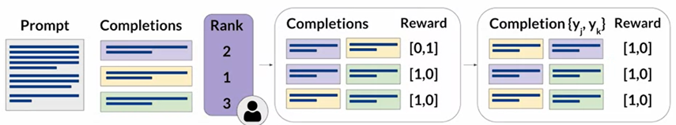

# Generative AI
This document explores various phrases of utilizing generative AI models, focusing on selecting appropriate models, optimizing through adaptation and alignment strategies, and integrating them into real-world applications.

## Table of Contents
1. [Select a Model](#Select-Model)
2. Adapt and Algin Model
   1. [Prompt Engineering](#Prompt-Engineering)
   2. [Fine-Tuning](#Fine-Tuning)
   3. [Algin with Human Feedback](#Human-Feedback)
   4. [Evaludate](#evaluate)
3. [Application Integration](#deploy)

## Definitions

**self-attention** = mechanism allowing model to focus on different parts of the input

**Transformer**
* input  
* → tokenization (break into words/subwords…)  
* → embedding (token to vector that captures the meaning)  
* → positional encoding (adding position info with embedding info)  
* → self-attention mechanism for each token in parallel  
* → feed-forward neural networks  
* output  
* → decoder (for sequence generation tasks)

## Select Model
**Encoder-only**
- for understanding/processing input sequence
  - ex. classification, token tagging, sequence labeling
  - ex. BERT (bidirectional encoder representation from transformers)
- input sequence into context-rich output
- uses bidirectional attention to capture context from both sides of each token

**Decoder-only**
- for generating output sequence
  - ex. text generation, translation, completion
  - ex. GPT (Generative pretrained transformer)
- output one token at a time using unidirectional/causal attention (only previous tokens)
- used in language modeling and autoregressive text generation

**Encoder-decoder**
- for tasks that require both understanding and generating sequences
  - ex. translation, summarization, sequence-to-sequence tasks
  - ex. T5 (Text-to-text transfer transformer), BART (bidirectional & auto-regressive transformer)
- encoder generates context-rich representation
- decoder uses encoder’s output and generates the output sequence

## Prompt Engineering

**ICL (in-context learning)**
- zero ~ five shot inference
- works for small model
- waste space in context window

## Fine-Tuning
**Find-Tuning Types**
1. Instruction fine-tuning**
   - Fine-tuning a model to follow specific instructions better.
   - Trains models using examples that demonstrate how to respond process
2. Developer-specific fine-tuning**
   - Fine-tuning for specialized applications.

**Fine-Tuning Process**

1. Preparing Training Data**
   - Convert existing datasets into instruction prompt datasets using prompt template libraries.
   - eg. Amazon reviews dataset

2. Training Process**
   - Divide the dataset into training, validation, and test splits

   - Challenges: Catastrophic Forgetting
     - Fine-tuning modifies the weights of the original LLM.
     - Good on the fine-tuned task BUT bad on other tasks.
   - Methods to Catastrophic Forgetting
     - #1 - Assess Impact of forgetting on your desired LLM
     - 

#2 - Multitask Fine-Tuning to maintain multitask capabilities.

       - Uses a mixed dataset of tasks to get an instruction-tuned model capable of handling multiple tasks well.
       - ex: FLAN family of models (e.g., FLAN-T5 and FLAN-PALM).
         - FLAN models
         - Specific set of instructions used to perform instruction fine-tuning
       

     - Method#3 - Parameter Efficient Fine-Tuning (PEFT):
       - Preserves most of the original LLM weights and only trains a small number of task-specific adapter layers and parameters.
       - Greater robustness to catastrophic forgetting

3. Evaluation with holdout validation
   - Measure performance using the holdout validation dataset to get validation accuracy.
     - hard to measure correctness with LLMs
   - Perform final performance evaluation using the holdout test dataset to get test accuracy.
### Parameter Efficient Fine-Tuning (PEFT)
- Fine-tuning a smaller number of weights ⇒ smaller memory footprint
- Trade-offs on parameter efficiency, memory efficiency, training speed, model quality, and inference costs

**PEFT Methods**
1. Selective 
   - subset of parameters
2. **Reparameterization** 
   - reduce the number of parameters to train by creating new low-rank transformations of the original network weights
   - 

     
eg. LoRA (Low-Rank Adaptation)

     
     
     - **Memory Efficiency:** Can often be performed with a single GPU
     - **Task-Specific Fine-Tuning:** Fine-tune a different set for each task and switch them out at inference time.
     - **Inference Latency:** Little to no impact since the model has the same number of parameters as the original.

   

3. 

    
<b>Additive</b>

   - freezing original model weights or adding adaptive layers)
   - **Adapter**: add new trainable layers to the architecture of the model.
     - Typically placed inside the encoder or decoder components after the attention or feed-forward layers.
     - Purpose: Enhance model performance by introducing trainable layers without modifying the original model weights.
   - **Soft Prompt**
     - Keep the model architecture fixed & manipulate the input.
     - Adds trainable tokens to prompts, leaving model weights frozen.
     - **Task-Specific Fine-Tuning:** Able to switch also.
     - Techniques:
       - Adding trainable parameters to the prompt embeddings.
       - Keeping the input fixed and retraining the embedding weights.
     - Purpose: Improve performance by adjusting how inputs are represented and processed by the model.
   

**Prompting vs. Fine-Tuning**
- Developers often start with prompting for performance.
- Fine-tuning with PEFT techniques is crucial when prompting hits a performance ceiling.

**Cost Considerations**
- Full fine-tuning can be cost-prohibitive, making PEFT techniques more accessible.
- The cost of using a giant model vs. fine-tuning a smaller model is a significant consideration for many developers.
- Control over data and model size is important for applications needing in-house deployment.

**Conclusion**
- Exciting developments and techniques in fine-tuning are making generative AI models more accessible and efficient.
- The next video will focus on instruction fine-tuning.

## Human Feedback
Evaluate the response based on Helpfulness + Honesty + Harmlessness

### Terms

- 

  
Reinforcement Learning (RL)

  
  - Actions lead to new states, and effective actions are rewarded.
  - LLM generates text (actions) based on a prompt (state).
  - Rewarded for outputs that align with human preferences (e.g., helpful, non-toxic).
  - Reward can be from human evaluation (expensive) or reward model (trained from human evaluation)

  

- 

  
Human Feedback

  
  - Convert ranking data into pairwise comparisons of completions (N choose 2).
  - Make sure to reorder the pair so the preferred choice always comes first.
  

- 

  
Reward Model

  
  - The reward model acts as a binary classifier.
  

## Evaluate
Metrics include:
- recall (match rate of reference words)
- precision (match rate of generated words)
- F1 score (harmonic mean of recall and precision).
- 

  
LLM Metrics #1 - ROUGE (Recall-Oriented Understudy for Gisting Evaluation)

  - For summarization tasks.
  - Compares generated summaries and human references.
  - ROUGE-1 considers single words (no order of words)
    
  - ROUGE-2 considers pairs of words
    
  - ROUGE-L focuses on the longest common subsequence
    
  - ROUGE clipping (bad completion but good score)
    
  

- 

  
LLM Metrics #2 - BLEU (Bilingual Evaluation Understudy)

    - For translation tasks.
    - BLEU score indicates how closely the translation matches the reference.
    - Evaluates precision of generated text compared to the human translation.
    - Metrics = avg(precision across range of n-gram size)
      - Ex. 
  

- 

    
For overall model evaluation, comprehensive benchmarks are preferred.

  - **GLUE (General Language Understanding Evaluation):**
    - Evaluates models on a collection of natural language tasks like sentiment analysis, question-answering, and textual entailment.
  - **SuperGLUE:**
    - Addresses limitations of GLUE with more challenging tasks.
  - **MMLU (Massive Multitask Language Understanding):**
    - For modern LLMs to evaluate extensive world knowledge and problem-solving abilities across multiple domains.
  - **BIG-bench:**
    - Provides a broad and challenging benchmark for evaluating LLMs on a wide array of tasks.
  - **HELM (Holistic Evaluation of Language Models):**
    - Improves transparency and provides guidance on model performance for specific tasks.
    - Ensures comprehensive evaluation, revealing trade-offs between different models and metrics.
  

### Reinforcement Learning from Human Feedback (RLHF)
- Aligns model outputs with human preferences.

- Improves the usefulness, relevance, and safety of generated text.
- Helps models acknowledge limitations and avoid harmful content.

- RL-updated LLM before 1st iteration =  Instruct fine-tuned LLM.
- RL-updated LLM after n iterations = Human-aligned LLM.

**RL algorithm**
- To update the weights of the LLM and move it towards generating more aligned, higher reward responses.
- Ex. PPO (proximal policy optimization) is commonly used.

  - higher entropy ⇒ higher creativity in completion

<b>Potential problem: reward hacking</b>

- Distort completion for higher reward
- Avoid by keeping original/reference model fixed.
  - 
- Replace RL-updated LLM by adding PEFT to save half of the memory
  - 
- Scaling Human Feedback with Constitutional AI
  - 
  - Supervised Learning Phase
    - Red Teaming (Generate harmful responses) → Self-Critique → Revision → Training Data (use pairs of red-team prompts and revised responses for fine-tuning).

- RLAIF (Reinforcement Learning from AI Feedback)
  - Use model-generated feedback instead of human feedback.
  - Ask the model to rank responses to train the reward model based on the constitutional principles.
  - PPO Fine-Tuning
    - Further refine the model with PPO based on the reward model’s feedback.

## Deploy

**Ways to optimize model (save memory with similar performance)**
1. **Distillation:**
   - Use a larger teacher model to train a smaller student model.
   - Student model mimics the teacher model’s behavior.
   - Freeze teacher model’s weights.
   - Minimize the distillation loss with teacher’s probability distribution.
   - Apply a temperature parameter to the softmax function to soften the teacher model's output distribution.
   - Train the student model with standard softmax for hard predictions.
   
2. **Quantization:**
   - Post-training quantization (PTQ) transforms model weights and/or activation layers to a lower precision representation.
   - Possible small percentage reduction in model evaluation metrics, balanced by cost savings and performance gains.
3. **Pruning:**
   - Remove redundant weights that contribute little to model performance (weights close to zero).
   - Limitation: may have minimal impact due to fewer redundant weights.

**Time/effort of lifecycle**

**Issues after training:**
- Orchestration libraries like Langchain manage user input and model completions.
- 

    
Issue #1: knowledge cutoffs ⇐ RAG

    
    
    - Solved with Retrieval Augmented Generation (RAG) by integrating external data.
    - Increases relevance and accuracy without frequent retraining.
    - **Advantages of RAG**
      - Overcome Knowledge Cutoff: Provides access to up-to-date information.
      - Avoid Hallucination: Reduces incorrect information by using verified external sources.
    - External Information Sources (e.g., vector stores for efficient searches).
    - **Key Considerations**
      1. Context Window Size:
         - Challenge: External text often exceeds context window.
         - Solution: Split data into manageable chunks.
      2. Data Retrieval:
         - Requirement: Data formatted for easy retrieval.
         - Embedding Vectors: Facilitate fast and relevant searches.
           - Vector databases = vector store where each vector is also identified by a key.
         
         
  
 

- 

    
Issue #2: Complex Math ⇐ PAL, ReAct

    
    - Chain-of-thought can improve reasoning by prompting the model to break down problems into intermediate steps, similar to human reasoning.
    - BUT still struggle with tasks requiring precise math.
    - **Program-Aided Language (PAL)**
      - Chain of Thought Prompting: The LLM generates Python scripts as part of its reasoning steps.
      - Execution: These scripts are executed by an interpreter to perform accurate calculations.
  
 

- 

    
Issue #3: Hallucination ⇐ ReAct

    
    - Question → Thought → Action → Observation
    - Action is predefined and triggered by thought.
    - Setting Up ReAct Prompts
      - Instructions: Define task and allowable actions.
      - Example Prompt: Includes multiple thought-action-observation sequences.
      - Inference: Combine instructions, examples, and the new question for the LLM to process.
        
    - Langchain (support for PAL and ReAct agents)
      
      
 

## Overall Architecture
