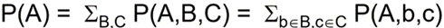

# Artificial Intelligence
## Table of Contents
1. [Intro to Search](#introduction-to-search)
   1. [Uninformed Search](#uninformed-search-dfs-bfs-ucs-ids-dls): DFS, BFS, UCS, IDS, DLS
   2. [Heuristic Search](#heuristic-search-a-best-first-local): A*, Best-First, Local Search
   3. [Game](#game): MinMax, Alpha-Beta Pruning, UCB, MCTS
2. Knowledge Representation
   1. [Constraint Satisfaction Problem (CSP)](#constraint-satisfaction-problems)
   2. [First Order Logic (FOL)](#first-order-logic)
3. [Classical Planning](#classical-planning)
   1. [STRIPS Planning](#strips-planning)
   2. [Planning as Heuristic Search](#planning-as-heuristic-search)
   3. [Planning as Satisfaction](#planning-as-satisfaction)
4. [Probabilistic Reasoning](#probabilistic-reasoning): Bayesian Network
5. Machine Learning
   1. [Linear Regression](#linear-regression)
   2. [Decision Trees](#decision-trees)
   3. [Neural Networks](#neural-nets)
   4. [Reinforcement Learning](#reinforcement-learning)

## Introduction to Search
- <details>
    <summary>Problem Definition</summary>

  * state-space model = a set of discrete states  
    * eg. driving states = towns/cities  
  * initial state (IS) & goal state (GS)  
    * solution is a sequence of actions leading from IS to GS  
  * actions/operators  
    * eg. road from one town to the other  
  * transition model  
    * a state that results from executing action a in state s  
  * action/path cost
  </details>

- <details>
    <summary>Classifying Environment</summary>

  * Static/Dynamic  
  * Deterministic/Stochastic  
    * outcome of actions is fully determined or not  
  * Observable/Partially Observable/Unobservable  
    * it knew initial state, current state  
  * Discrete/Continuous  

  </details>
- Abstracting State Space
- <details>
    <summary>Search algorithm</summary>

  * possible actions → expanding state → evaluate if the new state is the goal state  
  * control strategy (how to pick next path to expand) → search space  
    * search space (from the goal state, trace back to the start state) = trace  
    * repeated state (failure to detect visited nodes → linear problem to exponential)  

  </details>
- <details>
    <summary>Tree Search vs Graph Search</summary>

  * Tree Search - do NOT remember visited nodes (guaranteed to have NO cycle)  
    * space efficient  
  * Graph Search - DO remember visited nodes  
    * time efficient  
  * Ex. traveling in a 2d grid  
    * Tree Search O(4^d)  
    * Graph Search O(d^2) maximum go to a circle
  </details>
- <details>
    <summary>Challenges in Search</summary>

  * Start with unknown size/shape of the tree + unknown depth of goal state in the tree  
  * Tree size can be b^d where b = constant branching factor and d = depth of goal state  

  </details>
- <details>
    <summary>State vs Node</summary>

  * State = representation of physical config. State consists of nodes  
  * Node belongs to one state (we can have many nodes that are goal state)  
  * node has parent node, action taken from parent node, path cost, depth
  </details>

## Uninformed Search (DFS, BFS, UCS, IDS, DLS)
<details>
<summary>Basics</summary>

**Limitation of Uninformed Search**
- Uniformed Search = Blind Search
- search space size ⇒ tedious search

Basic Search Schema
- 3 basic states: explored (past), frontier (current), unexplored (future)
- Initial frontier = start state
- Search strategy with priority_queue:
  - FIFO (BFS)
  - LIFO (DFS)
  - g (UCS = Uniform-Cost Search = Dijkstra’s) = sort by the path cost so far
  - f (A*)
- Iterative search uses DFS
- Bidirectional Search uses either BFS or UCS

Questions Addressed
- Q: What if a better path is found to a node already on the explored list? (It depends on heuristic search)

Search Strategy (Pick the Order of Node Expansion)
- Completeness: Always find a solution if it exists
- Time complexity + space complexity (measured with the following):
  - b = maximum branching factor
  - d = depth of least-cost solution
  - m = max depth of state space
  - (for UCS, C* = true cost of optimal goal, ε = min step cost > 0)
- Optimality: Always finds a least-cost solution

Goal Test
- Inserted into queue ⇒ when cost is non-decreasing function to depth
- When removed from queue → optimal solution
- Guard against short and expensive solution
- Some Depth-Limited Search, Iterative Deepening Search, DFS
- Example: 5 bit has 2^5 states. Number of edges for undirected graph = 2^5 * 5 / 2

Tree vs Graph Search
- Tree search: # nodes = # paths = 5! = 120 (could go back)
- Graph search: # nodes = choose(5,0)...choose(5, 5) = 32 (not go back)


</details>

<details>
<summary>BFS</summary>

```
func BFS()
    node ← NODE(problem)
    if node == goal then return node
    frontier = FIFO queue
    seen = set()
    while !empty(frontier):
        node = pop(frontier)
        for each child S in expand(node):
            if s == goal: return s
            if s not in seen:
                add s to seen
                add s to frontier
```
* Goal test: When inserted
* Complete? Yes
* Time = O(b^d) and same as the space
* Optimal? Yes for non-decreasing cost function only of depth and NO otherwise
* Usually space costly

</details>

<details>
<summary>UCS</summary>

```
func UCS():
    return Best-First-Search(problem, path-cost so far)
    //sort by g(n) = path cost so far
```
* Goal test: When node is popped off queue
* Complete? Yes if b is finite and step cost >= ε > 0
* Time/Space ~ O(b<sup>d+1</sup>)
* Optimal? Yes for any step cost >= ε > 0
* expands in other of optimal path cost
  * when a node is expanded, shortest path to it has been found
  * nodes are expanded in order of increasing path cost
* why step cost >= ε > 0?
  * otherwise, an infinite regress
  
* Ex. order of node expansion = S A B G, path found = SBG and cost of path = 10
  
</details>

<details>
<summary>DFS</summary>

* Goal test: When node is popped off queue
* Complete? No ⇐ fail when searching infinite-depth spaces (graph search to detect loops)
* Time ~ O(b<sup>m</sup>)
* Space ~ O(b*m)
* Optimal? No it may find a non-optimal goal first

BFS vs DFS
* BFS is better for shallow goals, many long paths, many loops, small search space
  * always better time wise, but worse memory wise
  * Graph search
* DFS is better for many goals, not many loops, few long paths, huge search space
  * always worse time wise, but better memory wise (linear space)
  * Tree search

</details>

<details>
<summary>IDS</summary>

IDS = DLS + Iterative Depth (Generally the Preferred Uninformed Search Strategy)
```
func DLS(problem, limit)
    node ← NODE(problem)
    if node == goal then return node
    frontier = LIFO queue (stack)
    while !empty(frontier):
        node = pop(frontier)
        if node == goal: return node
        if isCycle(node): continue
        if node.depth > limit then result ← cutoff
        for each child S in expand(node):
            add s to frontier

func IDS(problem):
    for depth = 0… inf:
        result = DLS(problem, depth)
        if result != cutoff return result
```
- When it pops, we test if it is a goal (LIFO ⇒ children order will be opposite)

DLS (Depth-Limited Search) only searches until depth L
- DFS ⇒ the children order will be opposite

If no solution found at L, increase L
 
* \# nodes generated in a DLS = b<sup>0</sup>+b<sup>1</sup>+...+b<sup>d-1</sup>+b<sup>d</sup>=O(b<sup>d</sup>)
* \# nodes generated in a IDS = (d+1)b<sup>0</sup>+db<sup>1</sup>+...+2b<sup>d-1</sup>+1b<sup>d</sup>=O(b<sup>d</sup>)
* DLS/IDS = b/(b-1)
* complete? yes
* time = O(b<sup>d</sup>)
* space = O(b*d)
* optimal? yes if cost is non-decreasing func of depth. No otherwise

* Goal test: When node is popped off queue
* Complete? No ⇐ fail when searching infinite-depth spaces (graph search to detect loops)
* Time ~ O(b<sup>m</sup>)
* Space ~ O(b*m)
* Optimal? No it may find a non-optimal goal first

BFS vs DFS
* BFS is better for shallow goals, many long paths, many loops, small search space
  * always better time wise, but worse memory wise
  * Graph search
* DFS is better for many goals, not many loops, few long paths, huge search space
  * always worse time wise, but better memory wise (linear space)
  * Tree search

</details>

## Heuristic Search (A*, Best-First, Local)
<details>
<summary>Basics</summary>

Definition
- Quick way to estimate how close we are to the solution
- **h(n)**: estimate the cost from node n to goal state (h(n) = 0 for goal nodes)
  - Defined by state of node n (cost/distance to go)
- **g(n)**: cost to n so far
- **h\*(n)**: true optimal cost from state of \( n \) to goal (may be unknown)
- **g\*(n)**: true optimal cost from start to state of \( n \) (may be unknown)
- f(n) = g(n) + h(n): estimate total cost from start node, go through node \( n \)

Comparison with Other Search Functions
- Uninformed search – sort frontier by \( g(n) \)
- Greedy best-first search – sort frontier by \( h(n) \)
- A* search – sort frontier by \( f(n) = g(n) + h(n) \)
  - Optimal for admissible / consistent heuristic
  - Generally preferred heuristic search framework
  - Memory issues can be addressed by RBFS, SMA*

Non-admissible heuristic
- adjust weight of g and h 
- f_w = (1-w)*g  + w*h 
  - w = 0 → UCS 
  - w = 1/2 → A* search 
  - w = 1 → Greedy Best-First search 
- if h is admissible, f_w is also admissible for 0 <= w <= ½ 

Effective of Heuristic Search
* Dominance = if h2 > h1 for all n then h2 dominates h1
  * h2 always better for search than h1
  * h2 expands fewer nodes than h1
* Effective branching factor b*
  * A* generates N nodes to find a goal at depth d, b* = b of a uniform tree of depth d that contains N+1 nodes
* Ex. 8-puzzle true cost = 26. avg # nodes expanded

Designing Heuristic
* Relaxed problem = same problem with fewer restrictions
* Ex. 8 puzzle original rule is a block can only move to the blank block
  * relaxed version1 = a block can move anywhere → h1
  * relaxed version2 = a block can move any adjacent blocks → h2
* Theorem: heuristic generated from relaxed model are consistent
  
  * total time of heuristic = heuristic computation + nodes expanded
  * more powerful heuristic ⇒ harder to compute + more pruning power
  * recognize a relaxed easy problem (so that we can solve using a greedy algorithm)
  * No dominates between h1 and h2, then we use max(h1, h2)


</details>

<details>
<summary>A* Search</summary>

- While uninformed search only considers the cost so far, and heuristic search only considers the cost to the goal, A* search takes both into account.
- \( f(n) = g(n) + h(n) \): Estimate total cost from start node through node \( n \).

- **Admissible Heuristic**
  - for every node n, h(n) <= h*(n)
    - h(n) = estimate cost from n to goal 
    - h*(n) = true cost from n to goal 
    - only underestimates but never overestimate the cost to get to the goal 
  - Theorem: if h(n) is admissible, A* Tree search is optimal
  - Example: 8 puzzle h1 and h2 are both admissible (h1 is more admissible, h2 is more accurate)
- **Consistent Heuristic**
  - for every node, every successor n’ of n generated by any action a 
    - c(n, a, n’) + h(n’) >= h(n)
    - c(n, a, n’)  >= – Δh 
    
  - f(n) is non-decreasing along any path 
    ```
    f(n’) = g(n’) + h(n’)
          = g(n) 
          = c(n,a,n’) + h(n’)
    ```
  - consistency ⇒ admissible
  - Theorem: if h(n) is consistent, A* Graph search is optimal 
  - consistency ⇒ A* search expands in order of f value
- Properties
  - Complete unless infinitely many nodes with f < f(G) 
    - cannot happen if step-cost >= ε
  - Time & Space Complexity: O(b<sup>m</sup>)
    - Space complexity is exponential and can be a problem.
    - Branching factor = # nodes for a typical search node.
  - Optimal if tree search is admissible and graph search is consistent.
    - If graph search is admissible but not consistent, we need to reopen nodes.
  - Optimal Efficiency
  - Memory is the major limitation of A*.
    - Addressed by IDA (Iterative Deepening A*), RBFS (Recursive Best-First Search), MA* (Memory-Bounded A*), SMA* (Simplified MA*).

Example
- Admissible but not consistent:
  
  - admissible
    - h*(S) = 3 < 7
    - h*(B) = 2 < 5
    - h*(A) = 1 <= 1 
  - cost is the upper bound of Δh 
    - S → B: Δh = 2 <= 2
    - B→A: Δh=4 > 1 not consistent 
    - cost(start to end) >= – Δh = h(start) - h(end)

Why Different Optimality Conditions for Tree and Graph?
- Consistency avoids a costly scenario where we find a long cheap path after a short expensive path, and we need to update all descendants to use the new cheap path.
- This is why Dijkstra's algorithm doesn’t work with negative edges.
- Example: Removing Higher-Cost Identical Nodes
  

Properties of A* Search
- A* expands path along f(n) < C*, and never expands any nodes f(n) > C*
- h1 and h2 are both admissible h1 < h2 ⇒ h2 is better and expands fewer nodes


### Non-Admissible Heuristic
- Adjust the weight of \( g \) and \( h \):
  - \( f_w = (1-w)g + wh \)
  - \( w = 0 \) → UCS
  - \( w = \frac{1}{2} \) → A* search
  - \( w = 1 \) → Greedy Best-First search
- If \( h \) is admissible, \( f_w \) is also admissible for \( 0 \leq w \leq \frac{1}{2} \).

</details>

<details>
<summary>Best First Search</summary>

- Order nodes by evaluation function
- Greedy best first: order by \( h(n) \)
- A* search: order by \( f(n) \)
- (Branch and Bound DFS prune by \( f(n) \) against Upper Bound)
- Better heuristic function ⇒ faster search

Examples
- 8 Puzzle
  - Average solution cost = 22 steps
  - Branching factor ~3
  - Exhaustive search to depth 22 = \( 3.1 \times 10^{10} \) states
    - \( h_1 \): # of misplaced tiles = 8
    - \( h_2 \): sum of distance of the tiles from their goal (Manhattan distance) = 3+1+2+2+2+3+3+2 = 18
  
- Shortest Path in a Map
  - Choose_ the children with the smallest \( h(n) \) and add its children into the heap

Properties
- Complete?
  - Tree version can get stuck in loops (easy to prevent)
  - Graph version is complete in finite space
  - Incomplete in tree/graph in infinite search spaces
- Time & Space = \( O(b^m) \)
- Optimal? No
</details>

<details>
<summary>Local Search (non-systematic)</summary>

- **Systematic search**: Enumerates all nodes in a systematic manner (BFS, DFS, UCS, A*, etc.).
- **Local search**: Returns good but not necessarily optimal solutions.
- **State space**: Set of "complete" configurations.
  - Find a complete configuration satisfying constraints.
  - Examples: n-Queens, VLSI layout, airline flight schedules.
  - Configuration with best cost/value – optimization problem.
- **Local Search Algorithms**
  - Keep a single "current" state or a small set of states.
  - Memory efficient.
  - Iteratively try to improve it/them.
    ```
    best_found <- current_state <- initial(random)state()
    //now do local search
    loop do
        if (termination_criteria) then return best_found
        else
            current_state <- makeNeighbor(current_state)
            if( cost(current_state) < cost(best_found) ) then
                best_found <- current_state
    ```
  - termination criteria can be iteration #, clock time…
  - Problems - Stuck in local min/max.
    - Ridge problem (every neighbor is worse but may be better later).
    - Solution: Random restart when stuck.
    ```
    best_found <- randomState()
    //now do local search
    loop do
        if (termination_criteria) then return best_found
        else
            current_state <- localSearch(randomState())
            if( cost(current_state) < cost(best_found) ) then
                best_found <- current_state
    ```
    - Problem - quick to get near optimal, but hard to get to the real optimal.
      - Solution: Add visited state to tabu list (temporal blacklist with fixed length).
      ```
      best_found <- current_state <- randomState()
      //now do local search
      loop do
          if (termination_criteria) then return best_found
          else
              neighbor <- makeNeighbor(current_state)
              if neighbor is in hash_table then 
                  discard neighbor
              else
                  push neighbor onto fifo
                  pop oldest_state
                  remove oldest_state from hash_table
                  insert neighbor to hash_table
                  current_state <- neighbor
                  if( cost(current_state) < cost(best_found) ) then
                      best_found <- current_state
      ```
- Hill-Climbing Search
  - Always pick the neighbor with the highest value.
    - Example: 8-Queens.
  - Gradient descent in continuous search space.
    - Cost = \( J(\theta) \) where \( \theta \) = state.
    - Derivative = positive ⇒ increasing cost.
    - Multivariable ⇒ gradient vector.
    - Gradient = direction of steepest ascent.
    - Negative gradient = steepest descent.
- WalkSAT
  
- Local Beam Search
  - Start fromk states.
    - If successor S is the goal, stop. Else, add the best S and repeat.
    
  - May lose diversity as search progresses, resulting in wasted effort.
</details>

## Game
<details>
<summary>Basics</summary>

Assumptions
- Two agents against each other ("zero-sum").
- Fully observable environment.
- Game theory: deterministic, turn-taking, zero-sum, perfect information.

Types of Games
- Deterministic/Non-deterministic.
- Perfect/Imperfect information.


Search vs. Game
- **Search**: No adversary.
  - Solution = a path from start to goal.
  - Evaluation function \( f \) = estimated cost from start to goal through a given node.
  - Actions have costs.
- **Game**: Includes an adversary.
  - Solution = strategy.
  - Time limit ⇒ approximate solution.
  - Evaluation function = goodness of game position.

Define Game as Search
- **Initial state**: Starting position.
- **Player(s)**: Which player has the move in state \( s \).
- **Action(s)**: Action choices in state \( s \).
- **Result(s, a)**: Result of an action from state \( s \).
- **Terminal-test(s)**: Determines if the game is finished in state \( s \).
- **Utility(s)**: Number of terminal states \( s \) for player \( p \) (e.g., +1 for win, -1 for loss).
- Example: Game Tree of Tic-Tac-Toe
  
- Example: Game Tree of Grundy (Split a number in an uneven way)
  
  - \( 0 \) means MAX player's loss and MIN player's win.
  - For a (5-1-1) node:
    - MIN player's value = minimum of its children = \( \min(0, 1) = 0 \).
    - MAX player's value = maximum of its children = \( \max(0, 1) = 1 \).
    - MIN/MAX player can choose to win.
    - Value doesn't matter; we just want to know the right move.
</details>

<details>
<summary>MinMax - An Optimal Procedure</summary>

- Finds the optimal strategy or next best move for MAX.
- Brute force to generate the whole game tree and value of the leaf nodes, then backtrace.
- Example
  
  - MIN level nodes have values: 3, 2, 2.
  - MAX root node has value: 3.
- This approach minimizes the worst-case scenario.
- Pseudocode for MAX player as the root
  
- complete + optimal 
- time = O(b<sup>m</sup>) where m = depth of the tree, b = branching factor 
- space = O(bm) for dfs generates all actions at once 

Improve Game Search
* Why? game tree size can grow very large ⇒ exact solution is infeasible
* cutoff before game ends (certain depth) ⇒ large b will be not practical
  * eg. chess b^m ~ 10^6 and b=35 ⇒ m ~ 4 (4 look-ahead is a poor chess player)

H-MinMax
* Static (Heuristic) Evaluation Function
  * def = how good the situation is for the player
  * (eg. X for player 1 then -X for player 2)
* Ex. tic-tac-toe
  * static evaluation function = # of possible win lines
    
    * For X, it has 6 possible wins = 2 rows + 2 col + 2 dia
    * For O, it has 5 possible wins = 2 row + 2 col + 1 dia
  * Generate game tree if we look 2 steps ahead (corner, center, edge)
    * MAX player’s 1st move
    
    * MAX player’s 2nd move
    
* MinMax vs H-MinMax
  * as soon as we choose the best move, heuristic function is good 
* Issues
  * time limit of a move → iterative deepening to get the good move
  * horizon effect ⇒ cannot see anything deeper
  * continue searching on promising branches or until the battle ends
  * need to eliminate some redundant search


</details>

<details>
<summary>Alpha-Beta Pruning</summary>

* α: Highest-value choice found at any choice point on the path of MAX (initially -inf).
* β: Lowest-value choice found at any choice point on the path of MIN (initially +inf).
* prune whenever α ≥ β 
  - MAX nodes, we want bigger value in children’s min
* Ex. tic-tac-toe 
  - left node’s EVAL = -1 
  - middle node is valuable if its min is larget than -1 (not worthy to search)
  
* Ex. 
  - 
  - update MIN’s b = 3 from its children. Update root’s a = 3 
  
  - the middle MIN will inherits root’s a & b to be 3 and +inf 
  
  - middle MIN update b = 2 from first child ⇒ when pass to next child, we have a >= b ⇒ prune the following children of middle MIN
* Pseudocode
  

Performance
* worst case = heuristic search (no pruning)
* best case = always choose the left-most move
* often O(b^(d/2)) instead of O(b^d)
* aha-beta doesn’t change the final result

Failure
* when search tree is too large ⇒ cannot reach the significant step
* ⇒ use ML on historical game pattern
* Sampling used when hard to compute/analyze exactly

Monte Carlo Sampling
* random pick moves until end → avg the result to get the best move
* self-play rollout → good/bad result means every move is good/bad
* compute avg win-rate over this position/move
* pick the highest avg win-rate

Exploitation vs. Exploration
* Exploitation = use old move with best win-rate
* Exploration = try new move
* Ex. multi-arm bandit with goal to minimize regret
  * regret = what you could have made – actual output
  * pick the best potential value instead of actual value
  * blue = potential, green = actual, red = estimated
</details>

<details>
<summary>UCB (Upper Confidence Bound)</summary>

  
- current value + bound value
- Heoffding’s inequality (prob of making a mistake is no more than …)
  
- calculate UCB
  
 
UCB gets logarithmic asymptotic total regret 
</details>

<details>
<summary>MCTS (Monte Carlo Tree Search)</summary>

- 
- Selection (UCT - upper confidence bound for trees)
  - 
- Ex. back-propagate 
  - add 1 to s_i of all antecedents 
  - add 1 to w_i if its parent wins
  
  
  - every time, we expand the tree by 1 node
  - pick the best move with highest wi/si (win-rate)
</details>

## Constraint Satisfaction Problems
<details>
<summary>Basics</summary>

**Constraint Satisfaction Problems (CSP)**: A problem composed of variables with possible values that fall within ranges (domains), and constraints that specify allowable combinations of values. 
* variables: discrete or continuous
* state = assignment of values to variables. 
  * complete/partial = all/not all variables are assigned
  * consistent = not violating constraints
  * solution = complete + consistent assignment (satisfy all constraints)
* constraint
  * unary involves a single variable (Ex. SA != green)
  * binary involves at most 2 variables (Ex. SA != WA)
  * higher-order involves 3 or more variables (ex. Job A, B, C all running at the same time)
    * can be expressed with multiple binary constraints
    * ex. Simple example: 3 variables X,Y,Z
      * Domains Dx={1,2,3}, Dy={1,2,3}, Dz ={1,2,3}
      * Constraint C[X,Y,Z] = {X+Y=Z} = {(1,1,2),(1,2,3),(2,1,3)}
        * (Plus other variables & constraints elsewhere in the CSP)
      * Create a new variable W, taking values as triples (3 tuples)
      * Domain of W is Dw ={(1,1,2),(1,2,3),(2,1,3)
        * Dw is exactly the tuples that satisfy the higher order constraint
      * Create three new constraints:
        * C[X,W] = { [1,(1,1,2)], [1,(1,2,3)], [2,(2,1,3) }
        * C[Y,W] = { [1,(1,1,2)], [2,(1,2,3)], [1,(2,1,3) }
        * C[Z,W] = { [2,(1,1,2)], [3,(1,2,3)], [3,(2,1,3) }
        * Other constraints elsewhere involving X,Y,Z are unaffected
  * preference (soft constraint) (ex. red is better than green)
    * hard constraint → satisfaction problem
    * soft constraint = preference can choose among solutions → optimization problem
* Example: Sudoku 
  * variables A1 to I9
  * domain Di = {1…9}
  * constraint: each row/column/block are different ⇒ 27 constraints
  


**Constraint Network**: A graphical representation of a CSP with nodes representing variables and edges representing constraints between variables.
* variable X1…Xn
* domains of discrete values D1…Dn
* binary constraints R_ij = list of allowed pairs of values. subset of D_i * D_j
* solution = assignment of all variables from their domain + not violating constraints
* a network of constraints represents relation of all solutions 

* Ex. Cryptarithmetic problems
  * SEND + MORE = MONEY
  * D + E = Y + 10a
  * a + N + R = E + 10b
  * b + E + O = N + 10c
  * c + S + M = O + 10d
  * d = M
  * 9891 + 1098 = 10989 can satisfy


**CSP as Search**: Can be solved using standard search algorithms by:
  - **States**: Representing partial assignments of values to variables.
  - **Initial State**: An empty assignment where no variables have values.
  - **Successor Function**: Assigning a value to an unassigned variable in a way that does not violate constraints.
  - **Goal Test**: All variables are assigned values, and no constraints are violated.

Commutativity 
* CPS’s output doesn’t depend on the order we assign variables (start point doesn’t matter)

search space
* pick a variable to expand during the search (if it violates the constraint, backtrack)
* Definition: given an ordering of the variables
* State = assignment to a subset of variables that is consistent.
* Operators = assigning values without violation
  * How to choose next variable? How to pick a value from the remaining values?
* Goal state = a consistent + complete

</details>

<details>
<summary>CSP Heuristics</summary>

**Backtrack Search**: A depth-first search algorithm that incrementally builds candidates to the solutions and abandons a candidate as soon as it determines that the candidate cannot lead to a valid solution.
  
* not efficient <= O(exp(n))
* Before search – reduce search space 
* During search – look-ahead and look-back can help


**Variable Ordering (Selection) Heuristics**
- **MRV (Minimum Remaining Values)** or **MCV (Most Constrained Values)**
  - Choose the variable with the fewest legal values left (easy to detect failure) in its domain.
  - reduce the branching factor
- **Degree Heuristic**:
  - Used to break ties after applying MRV.
  - Choose the variable involved in the largest number of constraints on other unassigned variables.

**Value Ordering (Selection) Heuristics**
- **LCV (Least Constraining Value)**
  - Once a variable is chosen, prefer the value that rules out the fewest choices for the neighboring variables in the constraint graph.
- ex. picking red on WA → NT and SA are the MRV
  
  - pick NT randomly → blue and green are both LCV → pick green randomly
  - SA becomes MCV → assign blue because it’s the only possible value
  - same problem using degree heuristic. We will start from SA because degree(SA) = 5 


Methods:
- **Look-Ahead**:
  - Removes values that will lead to inconsistency with other domains.
- **Forward Checking**:
  - Checks the unassigned neighbors in the constraint graph to ensure consistency.
  - keep track of legal values of all variables 
  - ONLY check neighbor of the most recently assigned variable 
  - backtrack if neighbor has NO legal values
  - Ex. map coloring
    - WA red → NT and SA have 2 legal values (blue and green)
    - 
    - pick Q as blue → NT and SA have 1 legal value (blue) + NSW has two 
    - pick B as blue → SA has no legal value → backtrack
    - 
    - SA →NSW: okay if NSW is red 
    - NSW → SA: consistent if NSW = red → remove blue from NSW 
    - V → NSW: remove red from NSW
    - SA → NT: not consistent (detect failure earlier than FC)

- **Arc Consistency**:
  - Ensures consistency among all other neighbors by checking and enforcing constraints.
  - Ex. sudoku
    - candidate value from block → check against row and column values
    
- **Look-Back**:
  - Techniques used to revisit previous variable assignments to resolve conflicts and inconsistencies that arise during the search.

**Constraint Propagation**:
- Performs additional work to reduce domains of variables and detect inconsistencies.
- Works effectively when combined with heuristics.

**Local Search**:
  - Non-systematic search strategy.
  - Often returns a good but not necessarily optimal solution.
  - Suitable for problems where the goal state is a complete configuration that satisfies constraints.
  - Ex. 4 queen starts with 5 conflicts 
    
    - stuck in local optima → random initial state OR random step on variable (walkSAT)


    number of conflicts after reassigning one variable
    x1	4	4	5	4
    x2	2	5?	4	5
    x3	4	3	5	3
    x4	3	5	5	5
    move x2 to 1 where conflict is 2
    x1	3	3	2	1
    x3	2	2	2	0
    x4	2	2	3	2


**Min-Conflict Heuristic**:
  - Iteratively tries to improve the current state by minimizing the number of conflicts.
  - Effective in practice, especially for large problems.

**Iterative Min-Conflicts**:
  - Often effective in practice.
  - A heuristic search algorithm that attempts to minimize the number of conflicts with each variable assignment.

- **Graph Structure**:
  - The complexity of CSPs is determined by their graph structure.
  - **Tree-Structured CSPs**:
    - Can be solved in linear time due to their acyclic nature.
    - select root and do arc consistency from leaves to root 
      - D→F: remove D’s value that is not consistent with F 
      - D→E; B→D; B→C; A→B; 
    - select values from the legal values
</details>

## First Order Logic
<details>
<summary>Basics</summary>

**First Order Logic (FOL)**: Extends propositional logic by including objects, properties, and relations.
- **Syntax**: Defines the formal structure of sentences in FOL.
- **Semantics**: Defines the meaning of sentences based on interpretations.

**Basic Elements**
- **Predicates**: Represent properties of objects or relations between objects (e.g., `Brother(x, y)`).
- **Functions**: Map objects to other objects (e.g., `Father(x)`).
- **Logical Connectives**:
  - **Implication** ⇒
      - (P ⇒ Q) ↔ (¬P ∨ Q)
  - **Biconditional** ⇔ 
      - P ⇔ Q is equivalent to (P ^ Q) v (¬P ^ ¬Q)
- **Quantifier**
  - ∀ x P(x) = for all x, P(x) = ¬∃ x ¬P(x)
    - Universal Quantifier usually use implication 
  - ∃ x P(x) = for some x, P(x) = ¬∀ x ¬P(x)
    - Existential Quantifier usually use ^ instead of =>
  - 
- FOL CNF
  - (P → Q) ↔ (¬P ∨ Q)
- Unification 
  - θ = list of substitution {variable/tem}
  - Subst(θ, p) = result of substituting θ into sentence p
  - unify algorithm takes two sentences p, q and returns unifier if one exists 
    - unify(p, q) = θ where Subst(θ, p) = Subst(θ, q)
    - that make p and q syntactically identical


### Inference Rules
- **Universal Elimination**:
  - From \(\forall x P(x)\), infer \(P(c)\) for any constant \(c\).
- **Existential Introduction**:
  - From \(P(c)\) for some constant \(c\), infer \(\exists x P(x)\).
- **Existential Elimination**:
  - From \(\exists x P(x)\) and a proof that \(P(x)\) implies \(Q\), infer \(Q\).
- **Universal Introduction**:
  - From \(P(x)\) for a variable \(x\) that does not appear elsewhere in the proof, infer \(\forall x P(x)\).

### Normal Forms
- **Prenex Normal Form**:
  - All quantifiers are moved to the front of the formula.
- **Skolemization**:
  - The process of removing existential quantifiers by introducing Skolem functions.

### Resolution
- **Resolution Rule**:
  - A rule of inference used for FOL.
  - From \(P(x) \lor Q\) and \(\neg P(y) \lor R\), infer \(Q \lor R\) (after unification of \(x\) and \(y\)).
- **Unification**:
  - The process of finding a substitution that makes different expressions identical.

### Applications
- **Knowledge Representation**:
  - Used to represent and reason about knowledge in artificial intelligence.
- **Theorem Proving**:
  - Automated reasoning systems use FOL to prove theorems in mathematics and other fields.

</details>

## Classical Planning
<details>
<summary>STRIPS Planning</summary>

**Situations**
- A situation is a history of actions. It represents a state of the world at a given point in time.
- Initial Situation (S0): The starting point or the initial state of the world.

**Actions**
- Action: An action is an event that causes a transition from one situation to another.
- Action Function (do): The function `do(action, from_state) → to_state` represents the situation resulting from performing action `a` in situation `s`.

**Fluents**
- Fluents: Fluents are properties that can change over time. They are used to describe the state of the world.
- Relational Fluents: Represent relationships between objects (e.g., `At(x, y, s)`).
- Functional Fluents: Represent functional properties (e.g., `Position(x, s)`).

STRIPS Terms:

**States**
- States are representations of the world at a specific point in time.
- Ex. `At(Agent, RoomA) ∧ Clear(RoomA) ∧ Clean(RoomA)`

**Actions**
- An action consists of:
  - **Preconditions**: Conditions that must be true before the action can be performed.
  - **Add List**: Conditions that become true as a result of the action.
  - **Delete List**: Conditions that become false as a result of the action.
- Ex. Action: `Move(Agent, RoomA, RoomB)`
  - Preconditions: `At(Agent, RoomA) ∧ Clear(RoomB)`
  - Add List: `At(Agent, RoomB)`
  - Delete List: `At(Agent, RoomA)`

**Goals**
- Goals are desired conditions that the planning system aims to achieve.
- They are specified as a set of predicates that should be true in the goal state.

**STRIPS Algorithm**
- Divide-and-Conquer Forward Search with Islands
- Recursive STRIPS Algorithm
  1. Take a goal from the goal set.
  2. Find a sequence of actions satisfying the goal from the current state, apply the actions, resulting in a new state.
  3. If the stack is empty, then done.
  4. Otherwise, the next goal is considered from the new state.
  5. At the end, check goals again.
- Sussman Anomaly
  - **Problem**: RSTRIPS cannot find a valid plan.
  - **Scenario**: We want `On(A, B)` and `On(B, C)`. We will destroy one goal if we try to satisfy the other goal.
</details>

<details>
<summary>Planning as Heuristic Search</summary>

**Forward (Progression) State-Space Search**
- Start from the initial state and check applicable actions.
- Forward search space nodes correspond to individual (grounded) states of the plan state-space.
- Forward chaining fails due to large search space and large branching factor.

**Backward (Regression) State-Space Search**
- Start from the goal state and search for relevant actions.

**Heuristic Search Strategies**
- Relax Problem Idea: Get lower bounds on the least number of actions to the goal.
- Decomposition (Sub-Goal Independence): Compute the cost of solving each sub-goal in isolation and combine the costs.
- Other Ideas: Remove negative/positive effects/preconditions, abstraction (combine many states into one), FF (Fast-Forward Planner).

<details>
<summary>Planning Graph</summary>

- **No False Negatives**: If a goal never appears, it is unreachable.
- **Possible False Positives**: 
  - If a goal appears at time i, there is a plan that has no obvious flaw.
  - This can be detected by considering pairs of fluents/actions.
  - Goal estimated to be reachable in 25 steps might be reachable in 25+ steps in reality.

**Definition**: A sequence of levels that correspond to time-steps in the plan.
- Level 0 is the initial state.
- Each level = a set of literals + a set of actions.
  - Literals are those that could be true at the time step.
  - Actions are those that their preconditions could be satisfied at the time step.
- Works only for propositional planning.

**Example: Have Cake and Eat It Too**
- Planning graph of "have cake"

**Mutual exclusions（mutex)**:  are represented between literals and actions (cannot be executed/true at the same time).
- A mutex relation holds between 2 actions on the same level iff any is true:
  - **Inconsistency Effect**: One action negates the effect of another.
    - Example: "Eat(Cake) and persistence of Have(cake)"
  - **Interference**: The effect of one action conflicts with the precondition of the other.
    - Example: "Eat(Cake) and persistence of Have(cake)"
  - **Competing Needs**: Conflicting preconditions.
    - Example: Bake(Cake) and Eat(Cake).
- A mutex relation holds between 2 literals at the same level if:
  - One is the negation of the other or if each possible pair of actions that can achieve the 2 literals is mutually exclusive.

**Properties of Planning Graphs**
- **Literals Increase Monotonically**: Once a literal is in a level, it will persist to the next level.
- **Actions Increase Monotonically**: Since the precondition of an action was satisfied at a level and literals persist, the action’s precondition will be satisfied from now on.
- **Mutexes Decrease Monotonically**:
  - If two actions are mutex at level Si, they will be mutex at all previous levels at which they both appear.
  - If two literals are not mutex, they will always be non-mutex later.
- Because literals increase and mutexes decrease, it is guaranteed that we will have a level where Si = Si-1 and Ai = Ai-1, that is, the planning graph has stabilized.

**GraphPlan Algorithm**
- Start with a set of problem goals G at the last level S.
- At each level Si, select a subset of conflict-free actions Ai for the goals of Gi:
  - Goals Gi are covered.
  - No 2 actions in Ai are mutex.
  - No 2 preconditions of any 2 actions in Ai are mutex.
- Preconditions of Ai become goals of Si-1.
- Success if G0 is a subset of the initial state.
- Choose an Action During Backwards Search**:
  - Use a greedy algorithm based on the level cost of the literals.
- For any set of goals:
  1. Pick first the literal with the highest level cost.
  2. To achieve the literal, choose the action with the easiest preconditions first (based on the sum or max level of precondition literals).


</details>


</details>

<details>
<summary>Planning as Satisfaction</summary>

- Indexed Propositions with Time Steps**
  - On(A,B)<sub>0</sub>, ON(B,C)<sub>0</sub>
- Goal Conditions:
  - The goal conjuncts at time T, T is determined arbitrarily. 
- Initial State:
  - Assert (pos) what is known, and (neg) what is not known.
- Actions:
  - A proposition for each action for each time slot.
  - Exactly one action proposition is true at t if a serial plan is required.
- Formula:
  - If an action is true, then preconditions must have held.
- Successor State Axioms:
  - Every state must have a reason: F<sup>t</sup>+1 ⇔  ActionCausesF<sup>t</sup> OR (F<sup>t</sup> AND ActionCausesNotF<sup>t</sup>)

<details>
<summary>SATPlan</summary>

1. **Guess Length of Plan T**
2. **Initial State**: Conjunction of initial state literals and negation of all positive literals not given.
3. **For Each Action and Each Time Slot t**: 
   - Successor state axioms: If something became true, an action must have caused it.
4. **Exclusion Axiom**: Exactly one action at a time.

Notes
- To have a single plan, we may have mutual exclusion for all actions in the same time slot.
- We can also choose to allow partial order plans and only write exclusions between actions that interfere with each other.
- **Complexity**: `T * |Act| * |O|^p` where O = number of objects, p = scope of atoms.

**Ex: Flashlight Problem**
- Goal = put two batteries in flashlight and flashlight is on cap.
- 4 objects: Cap, Battery1, Battery2, Flashlight
- 2 predicates: On (e.g., On(C,F)), In (e.g., In(B1,F))
- Initial State = On(C, F) #cap is on flashlight
  - Assume initially : not In(B1,F) and not In(B2,F)
- Goal: On(C,F), In(B1,F), In(B2,F)
- 3 actions:
  
- assume Plan has 4 steps
- initial state = O(C,F,1) ^ not I(B1,F,1) ^ not I(B2,F,1)
- goal state = O(C,F,5) ^ I(B1,F,5) ^ I(B2,F,5)
- solutions:
  - RC1, IB1_2, IB2_3, PC_4 
  - RC1, IB2_2, IB1_3, PC_4

</details>


**Partial Order Planning**
- A state is a partial, incomplete, partially ordered plan.
- **Operators Transform Plans to Other Plans By**:
  - Adding steps
  - Reordering
  - Grounding variables


</details>

## Probabilistic Reasoning

<details>
<summary>Basics</summary>


**Joint Probability** 
- Sum Rule (Rule of Total Probability): 
  - Example: Determine the Probability of Catching a Fish 
    - Given a set of probabilities \( P(\text{CatchFish}, \text{Day}, \text{Lake}) \) where:
      - \( \text{CatchFish} = \{\text{true}, \text{false}\} \)
      - \( \text{Day} = \{\text{mon}, \text{tues}, \text{wed}, \text{thurs}, \text{fri}, \text{sat}, \text{sun}\} \)
      - \( \text{Lake} = \{\text{blue lake}, \text{ralph lake}, \text{crystal lake}\} \) 
    - \( P(\text{CatchFish} = \text{true}) \) = = \sum_{\text{Day}} \sum_{\text{Lake}} P(\text{CatchFish} = \text{true}, \text{Day}, \text{Lake}) \]
- **Bayes' Rule**
Bayes' rule relates the conditional and marginal probabilities of random events. It is used to update the probability estimate for an event based on new evidence.
  
  - P(a OR b) = P(a) + P(b) - P(a, b)
  - P(a) = degree of belief that event a is true (unconditional, marginal probability)

**Independent Variables**
* X and Y are independent
  * p(X,Y) = P(X) * P(Y)
  * P(X|Y) = P(X) and P(Y|X) = P(Y) (if p(Y), p(X) > 0)
  * ⇒ we don’t need fully joint distribution 
* X and Y are independent given Z
  * P(X,Y|Z) = P(X|Z) * P(Y|Z)
  * P(X|Y,Z) = P(X|Z) and P(Y|X,Z) = P(Y|Z)

**Example**: 4 Binary Random Variables (A,B,C,D)
* Full Joint Probability Table with 16 rows
* Conditional Independence
  * P(A,B,C,D) = P(A) P(B|A) P(C |A, B) P(D| A,B,C) (no saving yet..)
  * If B,C,D are conditionally independent given A, i.e.
  * if... P(C|A, B) = P(C |A), P(D|A,B,C) = P(D|A) [Naïve Bayes Model]
  * P(A,B,C,D) = P(A) P(B|A) P(C|A) P(D|A)
  * 4 Tables. With at most 4 rows

</details>

<details>
<summary>Bayesian Network</summary>

**Chain rule of probability**
* p(x,y,z) = p(x)  p(y|x) p(z|x,y) 
* p(x,y,z) = p(x) p(y|x) p(z|x) if y,z are cond. indep. given x (we can drop y in 3rd item)
* p(x,y,z) = p(x) p(y) p(z) if y and x are indep. and z and x are indep

**DAG (directional acyclic (no cycle) graph)**
* Node = random variable
* Directed Edge = conditional dependence
* Absence of Edge = conditional independence
* Ex. p(x,y,z) = p(x) p(y|x) p(z|y,x) 
  * // p(z|y,x) can be p(z|y) because no → between x and z
  * x -> y -> z
* Ex. p(a,b,c) = p(c|a,b) p(a) p(b)
  * a->b<-c
* Ex. p(a,b,c) = p(c|b) p(b|a) p(a)
  * a->b->c
* parent ⇔ conditioning variables (RHS)


**Building Bayesian Networks**
* Ex. 
  * – B = a burglary occurs at your house
  * – E = an earthquake occurs at your house
  * – A = the alarm goes off
  * – J = John calls to report the alarm
  * – M = Mary calls to report the alarm
  * Order the variables in terms of influence: {E, B} -> {A} -> {J, M}
  * Chain rule: p(J,M,A,E,B) = p(J|A) p(M|A) p(A|E,B) p(E) p(B)
  * 5 items ⇒ 5 tables
    * p(J|A) we need 2 rows = J’s true when A is true/false
    * p(M|A) we need 2 rows
    * p(A|E,B) we need 4 rows = A’s true when E,B is true/false
    * p(E) and P(B) we only need 1 row for each
    * 8 of those are conditional probabilities
    * \# rows = # combinations of parents/conditioning variables
* \# probabilities = O(n* 2^k) where k = # parents at maximum.
* \# probabilities = O(2^n) for joint distributions

**Independency**

* ex. Given Alam, John and Mary is cond. indep. because the value(alarm) is set
  * without knowing alarm, Mary and John is dependent, meaning that, if we know some information about Mary, we can infer some information about John
  * 
  * Given A, B and J are independent (breaks the chain with known value)
  * Without knowing A, E and B are independent
  * Given A, E and B are NOT cond. indep.
    * knowing result, we can infer causing variables


**D-separation**
* Markov Blanket area of X 
  * X’s parent/children
  * X’s children’s parent
* X is cond indep. of its non-descendants (rest of the network) GIVEN value of its parent (gray Markov Blanket area) 
* A path is “inactive” if it passes through:
  * Given V, X and Y are cond indep in the first two situations
  * Without V’s value, X and Y are cond indep in third situation
  
* ex. V known → U and Y are cond indep ⇒ X and Y are indep
  
  * U and Y are cond indep because all path are inactive UVY and UWY
  
 
Queries
* X = { X1, X2, ..., Xk } = query variables of interest
* E = { E1, ..., El } = evidence variables that are observed (given)
* Y = { Y1, ..., Ym } = hidden variables (not given)
* Ex. query variables are A and B
  * hidden variable = C
  * evident variable = D
  * 
  * What is the posterior conditional distribution of our query variables, given that fever was observed?
    * ```
      P(A,B|d) = α Σ_c P(A,B,c,d) 
      = α Σ_c P(A)P(B) P(c|A,B) P(d|c)
      = α P(A)P(B) 	Σ_c P(c|A,B) P(d|c)
      ```
  * What is the most likely posterior conditional assignment of values to our query variables, given that fever was observed?
    * ```
      argmax{a,b} P( a, b | d )
      = argmax{a,b} Σ_c P( a,b,c,d )
      = { a, not b }
      ```
* compute P(q|e)
  * 


</details>


## Linear Regression
<details>
<summary>Linear Regression</summary>

**Types of Machine Learning**
- **Supervised Learning**: Predict target values.
  - **Classification**: Predict discrete values.
  - **Regression**: Predict continuous values.
- **Unsupervised Learning**: No target values; find similarities, patterns, and explain features.
- **Reinforcement Learning**: Learn actions through rewards and penalties.

**Data Types**
- Includes binary, categorical, integer, and even missing values.
- Example: Load data into a matrix.
  ```
  import numpy as np
  iris = ng.genfromtxt('path/to/data.txt', delimiter=None)
  X = iris[:, 0:4]  #load data and split into feature, targets
  Y = iris[:, 4]
  print X.shape
  ```

**Prediction**
- **Nearest Neighbor Predictor**: Choose the \( y \) of the nearest known \( x \).
- **Linear Regression Predictor**: \( f(x) = \) predicted \( y \).
- Measuring Errors
  - **Mean Square Error (MSE)**
  - **Mean Average Error (MAE)**: More stable for outliers.

**Classification**
- **Decision Boundary**: Separate different results.

**Common Issues**
- **Overfitting**: Fewer errors in training, more in test data.
  - Solutions: Remove features (feature selection), get more data.
- **Underfitting**: More errors in both training and test data.
  - Solutions: Add features, increase model complexity, use less data.
- **Bias**: Error due to model assumptions.
- **Variance**: Error due to variance in training data.
  - 
  - constant (0) high bias & low variance		linear (1)
  - cubic (3) good balance	 		(9) low bias & high variance
  - changing training data ⇒ model changes a lot ⇒ high variance


**Ways to Split Data**
- **Cross-validation**: \( k \)-fold (hold one to validate), error = average of all folds.

**Notation**
- \( \hat{y} = \theta_0 + \theta_1 x_1 + \ldots \)
- Define feature \( x_0 = 1 \) (constant)
- Then \( \hat{y} = \theta^T x \) where \( \theta = [\theta_0, \theta_1, \ldots, \theta_n] \) and \( x = [1, x_1, \ldots, x_n] \)
- Error: \( y - \hat{y} = y - \theta^T x \)
- MSE: \( \frac{1}{m} \sum (\text{Error})^2 \)

**Gradient Descent**
- Cost function: \( J(\theta) \); aim to minimize cost ⇒ negative derivative.
- Issues:
  - Step size can be too large or too small.
  - Sensitive to starting point (local minima).
- **Stochastic/Online Gradient Descent**: Pick \( j \) randomly and update \( \theta \) with only \( j \).
  - Computationally faster with more data (especially at the beginning).
  - No longer strictly descent (stopping condition is hard to evaluate).
- **Mini-batch updates**: Compute/apply gradient descent with this batch.

**Nearest Neighbor**
- Draw the decision boundary with (r, b) pairs.
- **K-Nearest Neighbors (KNN)**
  - \( K = 1 \): No error, closest neighbor is itself.
  - Select \( k \) with validation data.
  - As \( n \) features increase, optimal \( k \) tends to increase as \( O(\log(n)) \).
  - Different distance measures, weighted distance.


</details>

<details>
<summary>Decision Tree</summary>

- Nested if-else Statements for Decision Trees
- Stop case: if error ≤ some constant. Set value to majority.
- Split test node: 
  - Use a greedy approach to score all possible features and split.
  - Score function measures "purity" of data after split (how easily we can predict after split).
  - Use Chi-squared test to decide if a split is necessary.
- **Entropy**
  - Formula: - sum (p(x) log (p(x)) )
  - For two outputs: H = -p log(p) - (1-p) log(1-p)
- Common measure is variance reduction.

</details>

<details>
<summary>Neural Nets</summary>

</details>

<details>
<summary>Reinforcement Learning</summary>

- Different from supervised learning:
  - No target value to predict.
  - Learn policy: best action of a state by maximizing cumulative reward.
  - **Agent**: Decides actions, gets next observation/reward.
  - **Environment**: Executes actions, computes observation and reward.
  - **Sequential Decision Making**
    - Goal: Maximize long-term reward.

**Markov Decision Process (MDP)**:
  - "Future is independent of the past given the present."
  - State transition probability. P<sub>ss'</sub> = P[S<sub>t+1</sub> = s' | S<sub>t</sub> = s]
  - **Example**
    - Sleep (square) is the terminal state.
      

- **Markov Reward Process (MRP)**:
  
  - γ = the discount factor.
  - State value = expected return starting from this state. v(s) = E[G<sub>t</sub> | S<sub>t</sub> = s]
  - Example rewards: 
    - Ex. γ = ½，R(FB) = -1, R(Sleep) = 0, R(C1/C2/C3) = -2, R(Pass) = 10, R(P) = 1 
      - averaging the sum of Gt, we get the state value 
      
    - Ex. v(s) = R(s) for γ = 0


**State Value Calculation**
- Averaging the sum of \( G_t \), we get the state value.
- Example: \( v(s) = R(s) \) for \( \gamma = 0 \).
- **Bellman Equation of MRP**:
  - v(s) = R(s) + γ * v(S_t+1) = immediate reward(current state) + inflated rate * next reward(next state)
  - Ex. γ = 1. v(C3) = R(C3) + 0.4*1*v(Pub) + 0.8*1*v(Pass)

**Policy**
- Defines the action to take given the state. 
- Fully defines agent's behavior.
- Depends on current state (not history) and is time-independent.
- **State-Value Function**: Value following policy (one state look-ahead).
- **Action-Value Function**: From state \( s \), take action \( a \) and then follow policy.
- Optimal value function for state-value and action-value.

**Optimal Policy**
- Example: Optimal value = 6 going to C2.

**Algorithms for MDPs**
- **Model-Free RL**: Agent observes everything.
- **Planning**: Agent knows everything.
  - A model of the environment is known.
  - Agent performs computations with its model (without external interaction).
  - Agent improves its policy (deliberation, reasoning, introspection, pondering, search).
- **Reinforcement Learning**:
  - Environment is initially unknown.
  - Agent interacts with the environment.
  - Agent improves its policy.

**Model of MDPs**
- Predicts what environment will do next.
- \( P \) predicts next state, \( R \) predicts next reward.
- **Iterative Policy Evaluation**:
  - For each iteration: v = immediate reward + sum of all P(s’)*v(s’)
- **Value Iteration**
  - Convergence if discount \( < 1 \) (even without reaching terminal state).
- **Find Optimal Policy**:
  - Evaluate policy with \( v_\pi (s) \).
  - Improve with \( \text{greedy}(v_\pi) = \text{choose the one with max } v_\pi \).
- **Value Iteration via Bellman Optimality**:
  - Among all possible actions, compute value of each action and pick the best one (no policy needed).

|Problem|Bellman Equation|Algorithm|
|---|---|---|
|Prediction| Bellman |Iterative Policy Evaluation|
|Control| Bellman+Greedy Policy Improvement| Policy Iteration|
|Control| Bellman Optimality | Value Iteration|

**Monte Carlo Learning**
- MDP unknown, evaluate policy \( \pi \).
- Sampling and complete episodes (end at the terminal state).


</details>